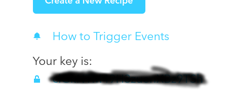
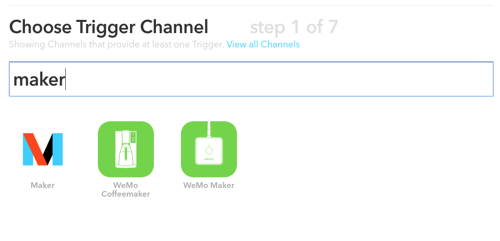
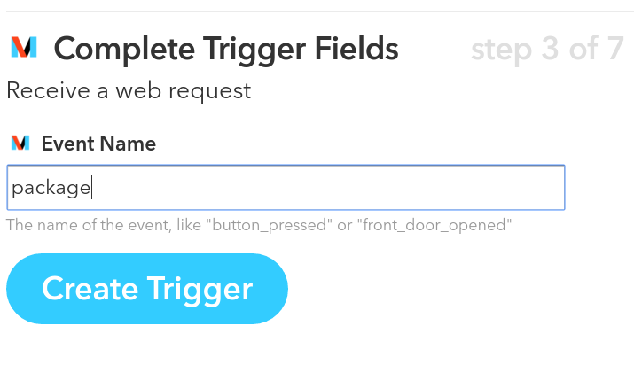

# ifttt-hook-translator

Translate webhooks to maker channel iftt requests!!

webhook package changes to IFTTT. trigger any action supported by IFTTT

actions flow through the ether like this.
```
[package change]->[npm hook]->[this server]->[https://maker.ifttt.com]->[any "that" integration]
```


## Slack example.

use the existing recipe:

https://ifttt.com/recipes/423099-npm-webhooks-to-slack-notif 

and skip to <a href="#addhook">adding the hook</a>

or create a new recipe that posts npm webhook changes to your slack!


after you complete the first time setup all you need to do to is add hooks with this server as the endpoint (example running on http://ifttt.npmjs.com )


### FIRST TIME SETUP

make your own recipe!

1. login and create and account on https://ifttt.com

2. visit https://ifttt.com/maker click "connect" button

  

3. copy your maker key  

  

4. create the recipe! visit https://ifttt.com/myrecipes/personal/new

  

5. click "this" and search for "maker". click the M logo

  

6. click the "Make web request" link

  

7. fill in "Event Name" field with "package"

  

8. click "That"

  

9. search for "slack". connect to slack. and click "post to channel"

  

10. fill out the form. 

  


### <a name="addhook">add a hook to a package/scope/or author</a>

wombat! open your terminal and run 

```
wombat hooks add <your scope or package> 'http://ifttt.npmjs.com/hooks?makerKey=<your key from step 3>&event=package' a-secret-does-not-matter
```

our bridge at http://ifttt.npmjs.com/ is just for fun/education and we do not intend on supporting this service as a public api. please deploy this server yourself =)
